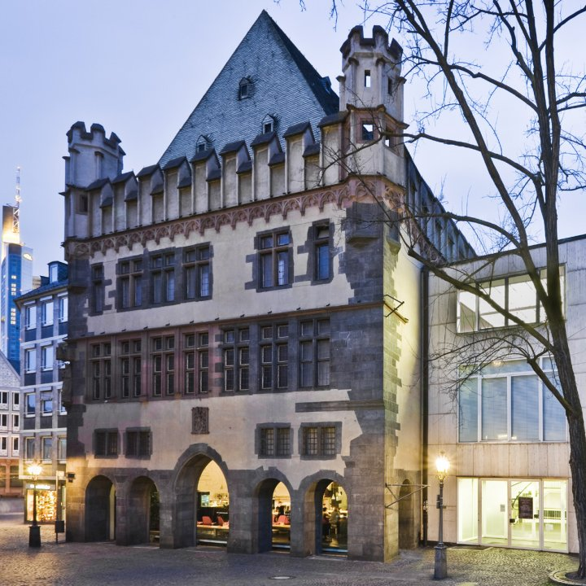

Dear vvvvriends. We are happy to welcome you again in Frankfurt this year from November 15th to 20th. We are happy to annouce the cooperation with the [Frankfurter Kunstverein](http://www.fkv.de) who will host our second edtition of NODE - Forum for Digital Arts in their wonderful location in the heart of Frankfurt. Please stay tuned for details on tickets and program.
<!--break-->
"NODE10 - Forum For Digital Arts" will take place between the 15th and 20th of November with an extensive festival program consisting of exhibitions, symposium and workshops at the Frankfurter Kunstverein.

The purpose of the inter-media forum is to facilitate the cross-border exchange between interactive media, digital art and generative design. The focus of this year’s event will be the investigation of cultural consequences of a post-industrial technological society. The exhibition "abstract abstract - the systematized world" will serve, within this context, to deepen the discourse on technology and society.

The selected works of art exhibited under the heading ‘abstract Abstract’ aim to decipher the systems of abstractions enmeshed in our Lebenswelt, such as, for instance, the use of digital image creation within the full creative scope of software technology.

In lectures followed by symposia, international artists, cultural workers and technologists will grapple with current and fundamental tensions between art, technology and society - and with the related issues. The vvvv group provides a comprehensive program of professional and elementary level workshops for a wide range of users. In the workshops, specific hardware and software solutions, as well as new ideas and concepts for media installations, will be presented and discussed.

Curators of the exhibition: [Eno Henze](http://www.enohenze.de),[ Marius Watz](http://www.unlekker.net)
Curation of the workshops: [Joreg](http://joreg.ath.cx/) (vvvv group)
Organizer: NODE e.V. (in Foundation) in cooperation with the Frankfurter Kunstverein and the vvvv group.
<http://node.vvvv.org>

for latest updates join our[ facebook group](http://groups.to/nodeforum)!

Foto/Photo: Norbert Miguletz, 2008
© Frankfurter Kunstverein