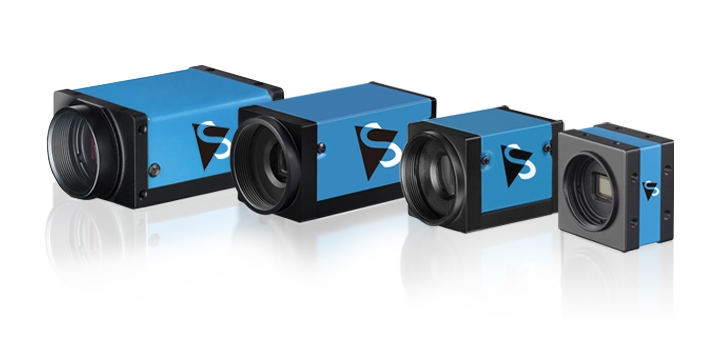

Dear patchers,

here is to introduce full support for industrial cameras by [The Imaging Source](https://www.theimagingsource.com/).

*"Established in 1988, The Imaging Source is a leading manufacturer of industrial cameras, video converters and embedded vision components for factory automation, quality assurance, medicine, science, security..."* and now also a breeze to use with vvvv!

Based on their [IC Imaging Control 4 SDK](https://www.theimagingsource.com/en-us/product/software/icimagingcontrol/) we've created the [VL.Devices.TheImagingSource](https://www.nuget.org/packages/VL.Devices.TheImagingSource) package, implementing a node-set for you to quickly access the streams of one or multiple cameras in parallel. 

A cameras configuration can be read from and written to a file. Individual properties can be configured and their status be read. Dead simple to use and you can leverage the full potential of the cameras with just a few clicks.

## Sponsor credits

For the sponsoring of this [open-source](https://github.com/vvvv/VL.Devices.TheImagingSource) development we bow to [ggml.io](http://ggml.io/).

And we thank The Imaging Source for providing a camera allowing us to test our implementation. 

If you also have a request for custom development, [get in touch](mailto:devvvvs@vvvv.org)!
